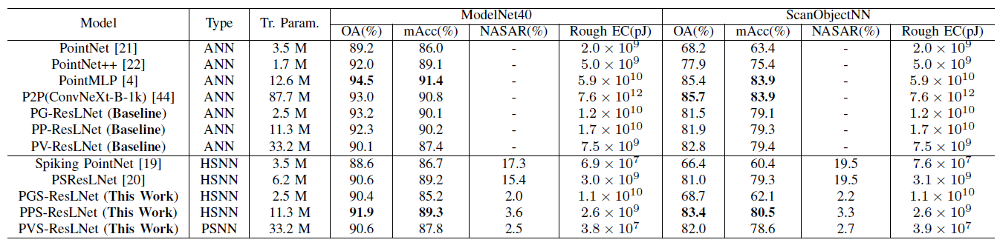
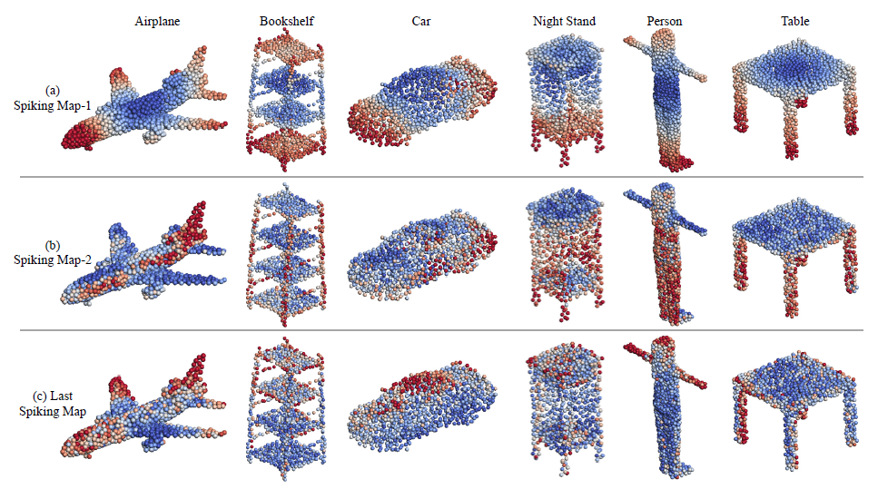
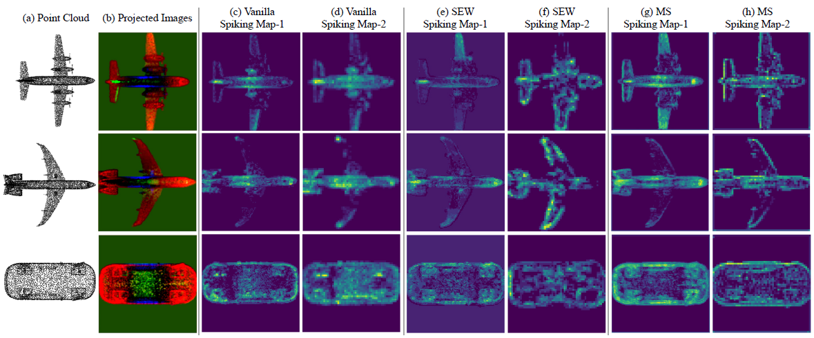
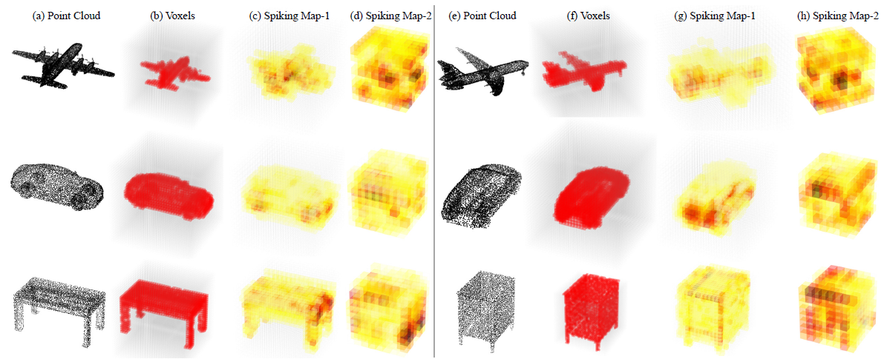

# Point-to-Spike Transformations for Energy-Efficient Point Cloud Processing with Spiking Residual Networks

We build **PGS-ResLNet**, **PPS-ResLNet**, and **PVS-ResLNet** for 3D point cloud classification, which can significantly reduce energy consumption while narrowing the performance discrepancy with SOTAs on two benchmark datasets, ModelNet40  and ScanObjectNN. Our work injects new perspectives and potential avenues of 3D point cloud processing, which can significantly benefit the development of energy-efficient 3D robotic perception systems. 




## Preparation

### Installation Prerequisites

- Python 3.8
- CUDA 11.8
- PyTorch 2.1.2
- timm 0.5.4
- torch_scatter
- [pytorch_geometric>=1.6.0](https://pytorch-geometric.readthedocs.io/en/latest/)
- cv2, sklearn, yaml, h5py
- [spikingjelly](https://github.com/fangwei123456/spikingjelly) 0.0.0.0.14

```
pip install torch_geometric
pip install torch-scatter -f https://pytorch-geometric.com/whl/torch-2.1.2+cu118.html
pip install torch-sparse -f https://pytorch-geometric.com/whl/torch-2.1.2+cu118.html
pip install torch-cluster -f https://pytorch-geometric.com/whl/torch-2.1.2+cu118.html
pip install torch-geometric
pip install timm==0.5.4
pip install opencv-python
pip install scikit-learn
pip install h5py
pip install pyyaml
pip install tqdm
pip install spikingjelly
```

- pointnet2_ops

```bash
mkdir lib
cd lib
git clone https://github.com/erikwijmans/Pointnet2_PyTorch.git
cd Pointnet2_PyTorch
pip install pointnet2_ops_lib/.
cd ../..
```

### Data Preparation

- Download the processed ModelNet40 dataset for **PGS-ResLNet** from [here](https://drive.google.com/drive/folders/1PwKuGN3SLJd1GsSg3G8XgMP783v_ON3F?usp=drive_link).

- Download the processed ModelNet40 dataset for **PPS-ResLNet** and **PPS-ResLNet**  from [here](https://shapenet.cs.stanford.edu/media/modelnet40_ply_hdf5_2048.zip). Or you can download the offical ModelNet from [here](https://shapenet.cs.stanford.edu/media/modelnet40_normal_resampled.zip), and process it by yourself.

- Download the official ScanObjectNN dataset from [here](http://103.24.77.34/scanobjectnn).

- The data is expected to be in the following file structure:

  ```
  |-- data/
      |-- ModelNet40_1/
          |-- modelnet40_ply_hdf5_2048
      |-- ModelNet40_2/
          |-- modelnet40_shape_names.txt
          |-- modelnet_train.txt
          |-- modelnet_test.txt
          |-- modelnet40_train_8192pts_fps.dat
          |-- modelnet40_test_8192pts_fps.dat
      |-- ScanObjectNN/
          |-- main_split/
              |-- training_objectdataset_augmentedrot_scale75.h5
              |-- test_objectdataset_augmentedrot_scale75.h5
  
  ```


## Usage

### PGS-ResLNet

```
cd PGS-ResLNet/modelnet_cls_snn
```

#### Train

For training PGS-ResLNet-18 on the  ModelNet40 dataset: 

```
python main.py --phase train --block res --n_blocks 18 --data_name modelnet --data_dir /path/to/modelnet40_1 --n_classes 40
```

#### Test

Use the parameter `--pretrained_model` to set a specific pretrained model to load. For example,

```
python main.py --phase test --block res --n_blocks 18 --pretrained_model /path/to/pretrained_model --data_name modelnet --data_dir /path/to/modelnet40_1 --n_classes 40
```


### PPS-ResLNet

```
cd PPS-ResLNet
```

#### Train

```
bash tool/train.sh EXP_NAME CONFIG_PATH
```

For example, to train PPS-ResLNet model with SewResNet-18 as base model on the ModelNet40 dataset:

```
bash tool/train.sh p2p-SewResNet-18-MN-IF-T1 config/ModelNet40/p2p-SewResNet-18.yaml
```

#### Test

```
bash tool/test.sh EXP_NAME CONFIG_PATH
```

For example, to test PPS-ResLNet model with SewResNet-18 as base model on the ModelNet40 dataset:

```
bash tool/test.sh p2p-SewResNet-18-MN-IF-T1 config/ModelNet40/p2p-SewResNet-18.yaml
```


### PVS-ResLNet

```
cd PVS-ResLNet
```

#### Train

```
bash tool/train.sh EXP_NAME CONFIG_PATH
```

For example, to train PVS-ResLNet model with SewResNet-18 as base model on the ModelNet40 dataset:

```
bash tool/train.sh vox-SewResNet-18-MN-IF-T1 config/ModelNet40/vox-SewResNet-18.yaml
```

#### Test

```
bash tool/test.sh EXP_NAME CONFIG_PATH
```

For example, to test PVS-ResLNet model with SewResNet-18 as base model on the ModelNet40 dataset:

```
bash tool/test.sh vox-SewResNet-18-MN-IF-T1 config/ModelNet40/vox-SewResNet-18.yaml
```


## Visualization Results

- **Visualization of average spiking responses from different spiking layers in PGS-ResLNet on ModelNet40.**




- **Visualization of average spiking responses from PPS-ResLNet with different spiking residual configurations.**



- **Visualization of average 3D spiking responses from different spiking layers in PVS-ResLNet.**




## Citation


## Acknowledgements

Our code is inspired by [p2p](https://github.com/wangzy22/P2P),  [DeepGCNs](https://github.com/lightaime/deep_gcns_torch), [spikingjelly](https://github.com/fangwei123456/spikingjelly).